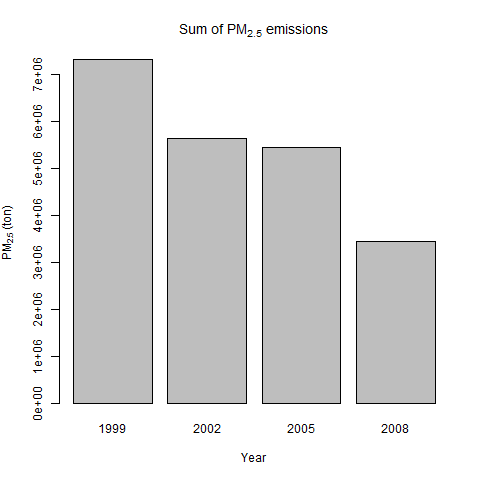

# Eploratory Data Analysis - week 4 assignment

## Data

The data for this assignment are available from the course web site as a single 
zip file:

[Data for Peer Assessment][1] [29Mb]

The zip file contains two files:

PM2.5 Emissions Data (summarySCC_PM25.rds): This file contains a data frame with
all of the PM2.5 emissions data for 1999, 2002, 2005, and 2008. For each year,
the table contains number of tons of PM2.5 emitted from a specific type of
source for the entire year.

Source Classification Code Table (Source_Classification_Code.rds): This table
provides a mapping from the SCC digit strings in the Emissions table to the
actual name of the PM2.5 source. The sources are categorized in a few different
ways from more general to more specific and you may choose to explore whatever
categories you think are most useful.

```
## This first line will likely take a few seconds. Be patient!
NEI <- readRDS("summarySCC_PM25.rds")
SCC <- readRDS("Source_Classification_Code.rds")
```

## Dataset comments

No line from the NEI dataset contains NA values.

```
# Creates a dataframe without duplicated rows.
uq.NEI <- unique(NEI)
duplicate.count <- nrow(NEI) - nrow(uq.NEI)
```

There are 105106 duplicate rows in the NEI dataset. From information in
[The 2008 National Emissions Inventory](http://www3.epa.gov/ttn/chief/net/2008inventory.html)
website, we know that emissions come from emission estimates and models. So
there shouldn't be any duplicate. That's why we'll remove duplicates from the
NEI dataframe.

## Questions

**Have total emissions from PM2.5 decreased in the United States from 1999 to 2008?**

Using the base plotting system, make a plot showing the total PM2.5
emission from all sources for each of the years 1999, 2002, 2005, and 2008.



```
df <- NEI %>%
  select(Emissions, year) %>%
  mutate(year = factor(year, levels = c(1999, 2002, 2005, 2008), ordered = T)) %>%
  group_by(year) %>%
  summarise(total.emissions = sum(Emissions))

plot(df$year, df$total.emissions,
     ylab = "PM2.5 (tons)", main = "Total PM2.5 emissions by year")
```

*We can see that total PM2.5 emissions actually decreased from 1999 to 2008.*

**Have total emissions from PM2.5 decreased in the Baltimore City, Maryland (fips == "24510") from 1999 to 2008?**

Use the base plotting system to make a plot answering this question.


```
df <- NEI %>%
  filter(fips == "24510") %>%
  select(Emissions, year) %>%
  mutate(year = factor(year, levels = c(1999, 2002, 2005, 2008), ordered = T)) %>%
  group_by(year) %>%
  summarise(total.emissions = sum(Emissions))

plot(df$year, df$total.emissions,
     ylab = "PM2.5 (tons)")
title(main = "PM2.5 emissions by year in\nBaltimore City", cex.main = 0.9)
```

*From the plot, we can say that 2008 emissions in Baltimore City are lower than in 1999.*

**Of the four types of sources indicated by the type (point, nonpoint, onroad, nonroad) variable, which of these four sources have seen decreases in emissions from 1999–2008 for Baltimore City? Which have seen increases in emissions from 1999–2008?**

Use the ggplot2 plotting system to make a plot answer this question.


```
library(ggplot2)

# Get the sum of Emissions in Baltimore
balt <- NEI[NEI$fips == 24510,]
balt$type <- factor(tolower(balt$type), c("point", "nonpoint", "on-road", "non-road"))

p <- ggplot(balt, aes(as.factor(year), Emissions)) +
  geom_bar(stat = "identity", aes(fill = type)) +
  facet_grid(. ~ type) +
  labs(x = "Year") +
  labs(y = expression("PM"[2.5]*" (ton)")) +
  labs(title = expression("PM"[2.5] * " emissions in Baltimore City")) +
  theme(legend.position="none")
print(p)
```


**Across the United States, how have emissions from coal combustion-related sources changed from 1999–2008?**

First challenge here is to determine what are the 'coal combustion-related 
sources'.

The interpretation I chose is all SCC rows where the EI.Sector contains both
'Fuel Comb' and 'Coal' + those containing 'Coal' in either SCC.Level.Three or
SCC.Level.Four. From those, I removed SCC related to Mining and Storage and
Transport. Of course, other valid interpretations exist.


```
library(ggplot2)

coal <- grep("Fuel Comb.*Coal", SCC$EI.Sector, ignore.case = T)
coal <- union(coal, grep("Coal", SCC$SCC.Level.Four, ignore.case = T))
coal <- union(coal, grep("Coal", SCC$SCC.Level.Three, ignore.case = T))
coal <- setdiff(coal, grep("Storage and Transfer", SCC$EI.Sector, ignore.case = T))
coal <- setdiff(coal, grep("Mining", SCC$EI.Sector, ignore.case = T))
coal.SCC <- unique(SCC[coal, "SCC"])
coal.NEI <- NEI[NEI$SCC %in% coal.SCC,]

p <- ggplot(coal.NEI, aes(as.factor(year), Emissions)) +
  geom_bar(stat = "identity") +
  labs(x = "Year") +
  labs(y = expression("PM"[2.5] * " (ton)")) +
  labs(title = expression("PM"[2.5] * " emissions related to coal combustion"))
print(p)
```

**How have emissions from motor vehicle sources changed from 1999–2008 in Baltimore City?**

**Compare emissions from motor vehicle sources in Baltimore City with emissions from motor vehicle sources in Los Angeles County, California (fips == "06037"). Which city has seen greater changes over time in motor vehicle emissions?**

I translated "motor vehicle sources" to "ON-ROAD" and "NON-ROAD" values of the
"type" field.


```
library(ggplot2)

motor.NEI <- NEI[NEI$type %in% c("ON-ROAD", "NON-ROAD"),]
baltimore <- motor.NEI[motor.NEI$fips == "24510",]
baltimore$city <- "Baltimore City"
losangeles <- motor.NEI[motor.NEI$fips == "06037",]
losangeles$city <- "Los Angeles"
both <- rbind(baltimore, losangeles)
both$city <- factor(both$city, levels = c("Baltimore City", "Los Angeles"))

p <- ggplot(both, aes(as.factor(year), Emissions)) +
  geom_bar(stat = "identity", aes(fill = city)) +
  labs(x = "Year") +
  labs(y = expression("PM"[2.5] * " (ton)")) +
  facet_grid(. ~ city) +
  labs(title = expression("Motor vehicle PM"[2.5] * " emissions")) +
  theme(legend.position="none")
print(p)
```

[1]: https://d396qusza40orc.cloudfront.net/exdata%2Fdata%2FNEI_data.zip "National Emissions Inventory"
